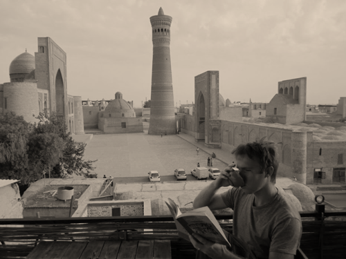

I am a historian of Eurasian history at the University of Pittsburgh, specializing in the history of Islam and empire as entangled sources of authority. My research focuses on the "even longer" 19th century, but I am interested in long-term continuities connecting this period both to pre-Islamic antiquity and the Soviet aftermath.

My teaching is wide-ranging, touching on my research themes from multiple angles: from early Islam to the Mongols to imperial Russian history. Capitalizing on Pitt's strength in Slavic studies, I tend to work with graduate students studying Eastern Europe and imperial Russian borderlands.

^
